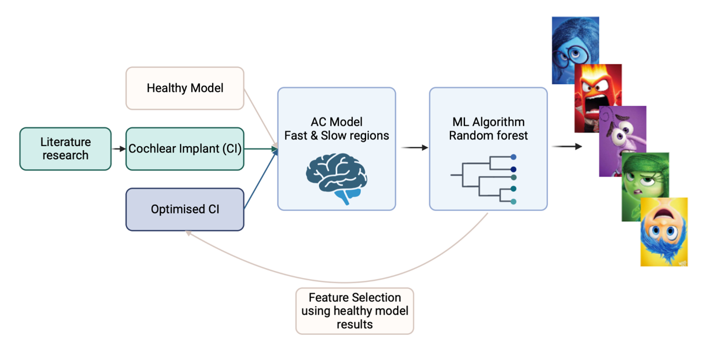

<h3 align="center">Exploring Sound Processing and Cochlear Implant Optimization: Integrating Computational Models and Machine Learning for Emotions Classification
</h3>

  

    Project Period 2 for System Biology 
  

<!-- ABOUT THE PROJECT -->
## About The Project

We have used mathematical model that resemble the tonotopic organizzation of the cochlea to explore speech recognition. In particular we have used .wav files to input recording from actors. 
Machine learning approaches are used to classify 5 emotions [Anger, Fear, Happiness, Disust, Sadness]. Specific channels (Neural populations firing at specific frequences) are used as features and filtered out to simulate cochlear implant. 

Bird eye view of the project:
* Model simulation 
* Machine Learning and feature selection 
* Cochlear implant vs Optimized Cochlear implant construction
  
AC model is described in the following article : [Spectro-Temporal Processing in a Two-Stream Computational Model of Auditory Cortex](https://www.frontiersin.org/articles/10.3389/fncom.2019.00095/full)

<!-- SCRIPT -->
### Script

Files to run the model

<!-- DATA -->
### Data
We have used the [Acted Emotional Speech Dynamic Database](https://mega.nz/folder/0ShVXY7C#-73kVoK05OjTPEA95UUvMw)                                                                                                                                                                                 
ps : in the folder *data* model output is found to run classification  

